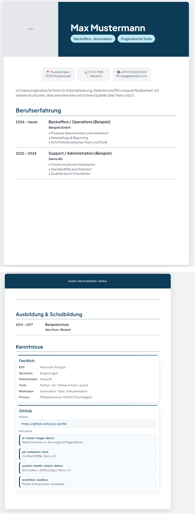

# cv-builder-demo

Ein kleiner, browserbasierter CV-Editor (HTML/JS) mit JSON Import/Export und Demo-Daten.
Public/Demo-Repo, whitelabel – kein internes Branding, keine echten personenbezogenen Daten.

## Features

- Interaktiver Editor im Browser (ohne Backend)
- Demo-Daten laden (zum schnellen Testen)
- Export als JSON (Speichern)
- Import aus JSON (Wiederherstellen)
- Whitelabel / neutraler Aufbau

## Quickstart

1. ZIP entpacken / Repo klonen
2. `index.html` im Browser öffnen (Chrome empfohlen)
3. Optional: „Demo-Daten laden“
4. Optional: „Speichern“ (JSON) / „Import“ nutzen

## Datenschutz / Public Repo Regeln

- Keine echten personenbezogenen Daten committen
- Keine Logs, Secrets oder internen Namen im Repo
- Die App speichert Daten nur lokal im Browser (LocalStorage) – andere Nutzer sehen das nicht

## Screenshots

## Struktur

- `index.html` Hauptanwendung
- `demo_data.json` Beispiel/Testdaten
- `docs/screenshot.png` Screenshot der kompletten Webseite
